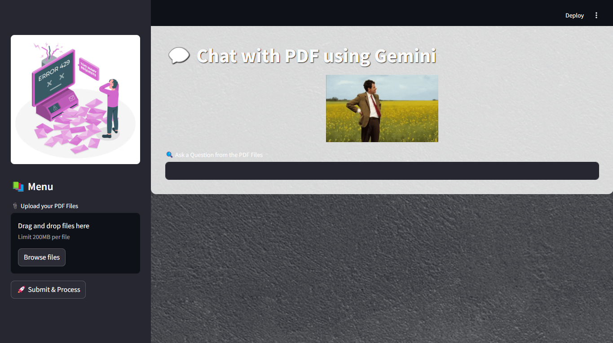

# 🧠 RAG-powered PDF Assistant

This project is an intelligent PDF Assistant that uses **RAG (Retrieval-Augmented Generation)** powered by **Langchain**, **Google Gemini**, and **FAISS-based vector embeddings** to provide accurate and context-aware responses from uploaded PDFs.

## 📸 Preview




## 🔍 Features

- ✅ Retrieval-Augmented Generation (RAG) for smarter, context-aware answers
- 🧠 Google Gemini as the LLM for fast and intelligent outputs
- 📚 FAISS for vector embedding and efficient similarity search
- 💡 Langchain for prompt orchestration and document handling
- 🎨 Built with Python and Streamlit for an intuitive and clean UI
- 📄 Upload and interact with any PDF using natural language

## 🛠️ Tech Stack

- **Python**
- **Streamlit** – for UI
- **Langchain** – for chaining and document processing
- **Google Gemini** – as the language model
- **FAISS** – for vector search and similarity indexing

## 🚀 How to Run

1. **Clone the repository**
   ```bash
   git clone https://github.com/sahilborse/doc-assistant.git
   cd pdf-assistant


2. **Create Virtual Environment**
   **🪟 Windows**
   ```bash
   python -m venv venv
   venv\Scripts\activate

   **🐧 Linux/macOS**
   ```bash
   python3 -m venv venv
   source venv/bin/activate

3. **Install Requirements**
   ```bash
   pip install -r requirements.txt


4. **Run the Application**
   ```bash
   streamlit run app.py
